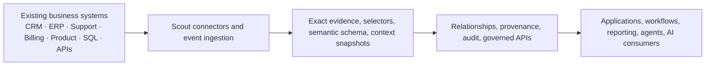

<p align="center">
  
</p>

<h1 align="center">KynticAI Scout</h1>

<p align="center">
  <strong>Open-source, customer-owned context infrastructure for AI-enabled software.</strong>
</p>

<p align="center">
  Scout connects to authorised business data, keeps the evidence in the customer's environment, turns disconnected records into governed context, and exposes that context through APIs, SDKs and local tooling.
</p>

<p align="center">
  <a href="LICENSE"></a>
  <a href="https://github.com/PaulJMaddison/kynticai-context-engine-scout/releases"></a>
  
  =20" />
</p>

<p align="center">
  <a href="#quick-start">Quick start</a> ·
  <a href="#what-scout-is">What Scout is</a> ·
  <a href="#the-three-products">The three products</a> ·
  <a href="#architecture">Architecture</a> ·
  <a href="#apis-and-sdks">APIs &amp; SDKs</a> ·
  <a href="#development">Development</a>
</p>

---

## What Scout is

Most companies already have the data they need for useful AI. The real problem is that the data sits in different systems, uses different identifiers, arrives in different shapes, and means different things depending on the business context.

Scout exists to solve that problem in software, not by pretending the model will magically fix it.

Scout is the open-source, customer-owned data plane in the KynticAI stack. It connects to authorised systems, captures or receives the data the customer has approved, builds governed context from it, preserves provenance and audit, and makes that context available to downstream applications, workflows and AI systems.

**Scout does not need an LLM to do its core job.** It prepares trusted inputs for AI, but source capture, context construction, provenance, continuity and APIs are data-plane concerns first.

## What you get in this repository

This repository is intended to be useful as a real open-source project, not just a thin wrapper around a hosted service.

### Included here

- Scout API and customer-owned data plane
- connector framework and public connectors
- exact source capture and continuity foundations
- selectors, semantic schema and context snapshots
- relationship and evidence foundations
- REST and GraphQL APIs
- TypeScript and .NET SDKs
- React web console
- webhook and source-event ingestion
- authentication, API clients, audit and provenance
- local Docker evaluation stack with observability
- Scout-to-Fortress continuity and export tooling
- generic Discovery Agent and public Scout Discovery MCP

### Not included here

- Fortress private production internals
- the private KynticAI Discovery MCP buyer workflow
- private enterprise connectors
- private governance modules and paid deployment packs
- managed support operations or hosted commercial control-plane internals

---

## The three products

KynticAI follows a simple progression: **Explore → Prove → Scale**.

### 1. Scout — Explore

Scout is the **open-source foundation** and the **customer-owned local data plane**.

Use Scout to see relationship context working on real authorised signals. It is where source access, connector credentials, exact evidence, selectors, context, provenance, audit and customer-facing APIs live. Scout can be used on its own.

### 2. Fortress — Prove

Fortress is the **private governed production platform**.

Use Fortress to validate a governed private path with measurable evidence. It adds the private enterprise capabilities that do not belong in the open-source core: stronger governance, advanced relationship and outcome analysis, private connectors, controlled upgrade ownership, private discovery workflows and production-grade commercial deployment paths.

### 3. Elite — Scale

Elite is the **enterprise scale layer** for programmes that move beyond one team or one deployment.

Use Elite when the programme crosses systems, divisions and security boundaries. It is the KynticAI path for organisation-wide scale, where context infrastructure must work consistently across complex estates without weakening the governance and evidence model underneath it.

> Clarity and Importance are separate KynticAI products. They are not part of Scout itself and are not required to run this repository.

---

## Why this matters

Without a context layer, most AI-enabled applications end up doing one or more of the following badly:

- sending disconnected records to models
- rebuilding source-specific logic in multiple places
- losing provenance
- mixing operational truth with generated interpretation
- struggling to explain where an answer came from
- breaking when data moves, changes or arrives out of order

Scout gives you a place to solve those problems once, properly, in the customer environment.

---

## Quick start

The easiest way to evaluate Scout is the Docker path.

### Prerequisites

- Git
- Docker Desktop or Docker Engine with Docker Compose

### Run Scout

```bash
git clone https://github.com/PaulJMaddison/kynticai-context-engine-scout.git scout
cd scout
sh ./scripts/start-scout-docker.sh --reset
```

**Windows PowerShell**

```powershell
git clone https://github.com/PaulJMaddison/kynticai-context-engine-scout.git scout
cd scout
.\scripts\start-scout-docker.ps1 -Reset
```

Then open:

- Scout web console: `http://127.0.0.1:5173`
- Scout API: `http://127.0.0.1:5198`
- OpenAPI / Scalar: `http://127.0.0.1:5198/api-docs`
- Grafana: `http://127.0.0.1:3000`
- Prometheus: `http://127.0.0.1:9090`
- Tempo: `http://127.0.0.1:3200`

### Demo login

| Field | Value |
|---|---|
| Tenant | `demo` |
| Email | `admin@scout.local` |
| Password | `DemoAdmin123!` |

The Docker start script builds the stack, waits for readiness, runs a self-test, registers a standard connector, checks connector health, and sends local source events so you can verify the full local path quickly.

For contributor-only non-Docker setup, see [docs/getting-started.md](docs/getting-started.md).

---

## What Scout does

| Capability | What it gives you |
|---|---|
| **Customer-owned data plane** | Source access, credentials, evidence, context, provenance and audit stay in the customer-controlled environment by default. |
| **Connector framework** | Public connector model with executable SQL/PostgreSQL, REST, CSV and demo/reference connectors. |
| **Exact source capture** | Customer-approved source payload evidence can be retained locally for continuity, replay and upgrade paths. |
| **Selectors** | Explicit rules turn source fields into canonical semantic attributes. |
| **Context snapshots** | Reusable context with confidence, freshness, explanation and provenance. |
| **Relationship foundations** | Linked records and local relationship evidence can be prepared before handing anything to AI consumers. |
| **Governed APIs** | REST and GraphQL surfaces for context lookup, recompute, selectors, audit, connectors and event ingestion. |
| **SDKs** | Typed TypeScript and .NET client libraries. |
| **Web console** | UI for sources, selectors, schemas, context, demo walkthroughs and audit. |
| **Observability** | OpenTelemetry plus local Prometheus, Grafana and Tempo in the Docker evaluation stack. |
| **Continuity** | Capture generations, exact evidence and ownership boundaries for controlled Scout-to-Fortress migration. |

---

## Architecture



A more practical way to think about Scout is:

1. connect to or receive authorised source data
2. retain the right evidence locally
3. normalise and interpret it through explicit rules
4. build governed context and relationships
5. expose the result to downstream software through normal APIs

---

## Discovery tooling

There are two discovery-related open-source components in this repository.

### Discovery Agent

A generic local codebase auditing and handover tool. It helps inspect repositories and produce structured handover material.

Path: `apps/discovery-agent`

### Scout Discovery MCP

A public MCP server for Scout metadata inspection.

It exposes public connector and metadata information for AI tools and agent workflows without exposing private commercial discovery flows.

Path: `packages/typescript/scout-discovery-mcp`

> The private commercial **KynticAI Discovery MCP** does **not** belong in this repository. It belongs in Fortress.

---

## APIs and SDKs

Scout exposes both REST and GraphQL interfaces, plus typed SDKs.

### REST example

```bash
# machine token
curl -X POST http://127.0.0.1:5198/api/auth/token \
  -H "Content-Type: application/json" \
  -d '{"grantType":"client_credentials","clientId":"crm-service","clientSecret":"replace-me","scope":"context:read"}'

# read user context
curl "http://127.0.0.1:5198/api/v1/context/users/123?tenantSlug=demo" \
  -H "Authorization: Bearer <token>"
```

### GraphQL example

```graphql
query {
  userContext(input: { tenantSlug: "demo", externalUserId: "123" }) {
    fullName
    companyName
    summary
    overallConfidence
  }
}
```

### TypeScript SDK example

```typescript
import { createScoutClient } from '@kynticai/scout-sdk'

const scout = createScoutClient({
  baseUrl: 'http://127.0.0.1:5198',
  accessToken: process.env.SCOUT_TOKEN,
})

const context = await scout.users.getContext('demo', '123')
console.log(context?.fullName)
```

Useful references:

- [Public API Contract](docs/public-api-contract.md)
- [TypeScript SDK README](packages/typescript/scout-sdk/README.md)
- [.NET SDK docs](docs/sdk-development.md)

---

## Scout to Fortress continuity

Scout includes continuity foundations for a controlled move into Fortress.

That includes:

- exact source evidence retained locally
- capture generations
- generation membership
- ownership boundaries
- pause / transfer semantics
- customer-local export tooling

The important principle is simple: **derived JSON is not source truth**. If a customer upgrades from Scout to Fortress, the upgrade path should be based on exact evidence and explicit ownership transfer, not a vague re-interpretation of old output.

See:

- [docs/upgrade-compatible-source-capture.md](docs/upgrade-compatible-source-capture.md)
- [docs/migration-tool.md](docs/migration-tool.md)
- [LOCAL_VALIDATION.md](LOCAL_VALIDATION.md)

---

## Repository structure

```text
apps/
  web/                        React admin console and demo UI
  discovery-agent/            Generic discovery / handover tool
src/
  KynticAI.Scout.Api/         ASP.NET Core API
  KynticAI.Scout.Domain/      Domain model
  KynticAI.Scout.Application/ Application services
  KynticAI.Scout.Infrastructure/ Persistence, connectors, integrations
packages/
  typescript/scout-sdk/               TypeScript SDK
  typescript/scout-discovery-mcp/     Public Scout Discovery MCP
  typescript/scout-connector-validator/
  typescript/scout-metadata-audit/
  dotnet/KynticAI.Scout.Sdk/
tests/
docs/
scripts/
deploy/
```

---

## Development

### Local development

Key commands:

```bash
# backend tests
dotnet test tests/KynticAI.Scout.UnitTests/KynticAI.Scout.UnitTests.csproj
dotnet test tests/KynticAI.Scout.Sdk.Tests/KynticAI.Scout.Sdk.Tests.csproj

# web app
cd apps/web
npm run lint
npm test
npm run build

# TypeScript SDK
cd packages/typescript/scout-sdk
npm test
```

For the fuller validation route, including the disposable GCP path used for the heavier engineering gate, see:

- [LOCAL_VALIDATION.md](LOCAL_VALIDATION.md)
- [docs/testing/gcp-precloud-validation.md](docs/testing/gcp-precloud-validation.md)

### Production-style notes

Scout can run in local/demo mode or against PostgreSQL in more production-style environments.

Before any customer-facing deployment, use:

- [docs/production-install-checklist.md](docs/production-install-checklist.md)
- [docs/hosted-deployment.md](docs/hosted-deployment.md)
- [SECURITY.md](SECURITY.md)

---

## Key documentation

- [Getting Started](docs/getting-started.md)
- [Public API Contract](docs/public-api-contract.md)
- [Customer Data Plane](docs/customer-data-plane.md)
- [Connector Authoring Guide](docs/connector-authoring.md)
- [Connector Plugin Model](docs/connector-plugin-model.md)
- [Connector Catalogue](docs/connector-marketplace.md)
- [Webhook Events](docs/webhook-events.md)
- [Open Core Boundary](docs/open-core-boundary.md)
- [Enterprise Extension Points](docs/enterprise-extension-points.md)
- [Roadmap](docs/roadmap.md)
- [CHANGELOG](CHANGELOG.md)

---

## Project status

Scout is a serious open-source repository and a real local/customer-owned context-data-plane path, but this README does not pretend everything in the wider KynticAI commercial stack is public or included here.

A few important truths:

- Scout is useful on its own
- Fortress contains private commercial production capabilities
- Elite is the scale path for programmes crossing systems, divisions and security boundaries
- GitHub Actions is currently disabled in this repository, so heavier validation is run through the documented local and disposable GCP paths instead

That is an honest boundary and an intentional one.

---

## Commercial support and enterprise work

If you need private connectors, Fortress, Elite, production support, managed deployment help or a commercial engagement around this stack:

- **Email:** [paul@kynticai.com](mailto:paul@kynticai.com)
- **Website:** [kynticai.com](https://kynticai.com)

---

## Contributing

Contributions are welcome.

Please read:

- [CONTRIBUTING.md](CONTRIBUTING.md)
- [SECURITY.md](SECURITY.md)

---

## License

KynticAI Scout is released under the [MIT License](LICENSE).
