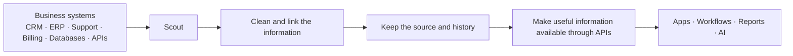

# KynticAI Scout

**Open-source software that connects business data and turns it into useful, trusted information for applications and AI.**

Scout runs in your own environment. It connects to the systems you already use, keeps a clear record of where information came from, links related information together, and makes the result available through simple APIs.

[](LICENSE)
[](https://github.com/PaulJMaddison/kynticai-context-engine-scout/releases)


[What Scout does](#what-scout-does) · [The three KynticAI products](#the-three-kynticai-products) · [Quick start](#quick-start) · [How it works](#how-it-works) · [For developers](#for-developers)

---

## What Scout does

Most businesses already have useful data. The problem is that it is spread across many places: CRM systems, finance software, support tools, databases, spreadsheets, websites and internal applications.

Those systems often describe the same customer, order, company, product or event in different ways.

Scout brings that information together.

For example, a customer may have:

- an account in a CRM
- orders in an ecommerce system
- support tickets in a helpdesk
- invoices in a finance system
- activity on a website

Scout can connect those records so other software can understand that they belong to the same customer and can see the useful background around them.

That useful background is what we mean by **context**.

Scout does this before the information is sent to an AI model or used by another application. The model does not have to guess how disconnected records fit together.

### In simple terms

Scout:

1. connects to business systems you allow it to use
2. reads or receives the approved data
3. keeps a record of the original information and where it came from
4. links related records together
5. turns them into useful information that other software can request

Your source credentials and business data stay under your control.

---

## Why Scout exists

AI is only as useful as the information it receives.

Giving a model a pile of unrelated database rows, documents and API responses does not automatically give it a good understanding of a business.

Scout handles the work that should happen before that point.

It can answer questions such as:

- Which records belong to the same customer?
- Which value is the newest one?
- Where did this piece of information come from?
- When was it last updated?
- Which systems disagree with each other?
- What information should an application receive about this customer, order or case?

This makes the information easier to use, easier to check and easier to explain.

Scout can also be used by normal software without any AI at all.

---

## The three KynticAI products

The main KynticAI platform has three levels: **Scout, Fortress and Elite**.

### 1. Scout — Explore

Scout is the open-source version in this repository.

Use it to:

- connect real business data
- see how information can be linked together
- build and test integrations
- try KynticAI on your own infrastructure
- create applications using the Scout APIs and SDKs

Scout can be used on its own.

### 2. Fortress — Prove

Fortress is the private production version of the platform.

It is designed for organisations that want to move from experimenting with Scout to running KynticAI as an important production system.

Fortress adds private commercial features, more advanced controls, private connectors and the production features needed for larger or more sensitive deployments.

Scout has been designed so that a customer can move to Fortress without starting again from scratch.

### 3. Elite — Scale

Elite is for large organisations using KynticAI across many systems, teams or parts of the business.

It is designed for programmes that cross departments, security boundaries and complex enterprise systems while keeping the same rules about data ownership, evidence and control.

**Scout → Fortress → Elite** gives customers a clear path from trying the technology, to proving it in production, to using it across a large organisation.

---

## What is included in this repository

Scout is a real open-source product, not just a small client library for a paid service.

It includes:

- the Scout API
- connectors for reading data from other systems
- support for SQL/PostgreSQL, REST APIs and CSV data
- rules for mapping source data into common fields
- storage for the useful information Scout builds
- links between related records
- a record of where information came from
- REST and GraphQL APIs
- TypeScript and .NET SDKs
- a React web interface
- webhooks and event input
- user and machine authentication
- audit records
- local Docker setup
- local monitoring tools
- tools for moving safely from Scout to Fortress
- the public Scout Discovery MCP
- the generic Discovery Agent

### What is not included

Some KynticAI software is private and commercial. That includes:

- Fortress source code
- Elite source code
- private enterprise connectors
- private production features
- the private KynticAI Discovery MCP used in the commercial discovery process
- paid deployment and support services

The public Scout repository and the private commercial products are deliberately kept separate.

---

## Quick start

The easiest way to try Scout is with Docker.

### You need

- Git
- Docker Desktop, or Docker Engine with Docker Compose

### macOS / Linux

```bash
git clone https://github.com/PaulJMaddison/kynticai-context-engine-scout.git scout
cd scout
sh ./scripts/start-scout-docker.sh --reset
```

### Windows PowerShell

```powershell
git clone https://github.com/PaulJMaddison/kynticai-context-engine-scout.git scout
cd scout
.\scripts\start-scout-docker.ps1 -Reset
```

When it starts, open:

- Scout web interface: `http://127.0.0.1:5173`
- Scout API: `http://127.0.0.1:5198`
- API documentation: `http://127.0.0.1:5198/api-docs`
- Grafana monitoring: `http://127.0.0.1:3000`
- Prometheus metrics: `http://127.0.0.1:9090`
- Tempo tracing: `http://127.0.0.1:3200`

### Demo login

| Field | Value |
|---|---|
| Tenant | `demo` |
| Email | `admin@scout.local` |
| Password | `DemoAdmin123!` |

The start script builds Scout, waits until it is ready, runs basic checks and loads enough sample activity to prove that the local setup is working.

For a developer setup without Docker, see [docs/getting-started.md](docs/getting-started.md).

---

## How it works



### Step 1: Connect a source

Scout connects to a system that the customer has approved, such as a database, REST API or CSV file.

### Step 2: Read the information

Scout reads only the information the connector has been configured to use.

### Step 3: Map it into common fields

Different systems often use different names for the same thing. One system may call a field `customer_name`, another may call it `fullName`.

Scout uses mapping rules to turn those differences into a consistent set of fields.

Inside the codebase these rules are called **selectors**.

### Step 4: Link related records

Scout can connect records that refer to the same person, company, product, order or other business item.

This is how disconnected data starts to become useful context.

### Step 5: Keep the evidence

Scout keeps enough information to show where a value came from and when it was seen.

This means an application can do more than say, “the customer name is Paul”. It can also show which source supplied that value and when it was last updated.

### Step 6: Make it available

Applications can request the resulting information through Scout's REST API, GraphQL API or SDKs.

---

## Moving from Scout to Fortress

A Scout installation may contain valuable source information and history. Moving to Fortress should not mean throwing that away or rebuilding everything from an exported summary.

Scout therefore includes a controlled upgrade path.

The important idea is simple:

**Fortress should rebuild from the real source evidence Scout captured, not just copy a final JSON result.**

Scout keeps the information needed to identify exactly what was captured and when. During an upgrade, ownership can then move from Scout to Fortress in a controlled way so both systems do not try to manage the same work at the same time.

The detailed engineering design is documented here:

- [Upgrade-compatible source capture](docs/upgrade-compatible-source-capture.md)
- [Migration tool](docs/migration-tool.md)
- [Validation guide](LOCAL_VALIDATION.md)

---

## Discovery tools

Scout contains two public discovery tools. They do different jobs.

### Discovery Agent

The Discovery Agent is a general tool for looking through a software repository and producing structured information about it.

It can help with code reviews, technical handovers and understanding an unfamiliar codebase.

Path: `apps/discovery-agent`

### Scout Discovery MCP

MCP is a standard way for AI tools to call other software.

The public Scout Discovery MCP lets compatible tools inspect Scout's public connector and metadata information.

Path: `packages/typescript/scout-discovery-mcp`

The **private KynticAI Discovery MCP** used in the commercial KynticAI discovery process is different software and is not part of this open-source repository.

---

## For developers

Scout provides REST and GraphQL APIs as well as TypeScript and .NET SDKs.

### REST example

First request a machine access token:

```bash
curl -X POST http://127.0.0.1:5198/api/auth/token \
  -H "Content-Type: application/json" \
  -d '{"grantType":"client_credentials","clientId":"crm-service","clientSecret":"replace-me","scope":"context:read"}'
```

Then request information about a user:

```bash
curl "http://127.0.0.1:5198/api/v1/context/users/123?tenantSlug=demo" \
  -H "Authorization: Bearer <token>"
```

### GraphQL example

```graphql
query {
  userContext(input: { tenantSlug: "demo", externalUserId: "123" }) {
    fullName
    companyName
    summary
    overallConfidence
  }
}
```

### TypeScript SDK example

```typescript
import { createScoutClient } from '@kynticai/scout-sdk'

const scout = createScoutClient({
  baseUrl: 'http://127.0.0.1:5198',
  accessToken: process.env.SCOUT_TOKEN,
})

const context = await scout.users.getContext('demo', '123')
console.log(context?.fullName)
```

More detail:

- [Public API Contract](docs/public-api-contract.md)
- [TypeScript SDK](packages/typescript/scout-sdk/README.md)
- [.NET SDK](docs/sdk-development.md)

---

## Repository layout

```text
apps/
  web/                        Scout web interface
  discovery-agent/            General repository discovery tool

src/
  KynticAI.Scout.Api/         HTTP API
  KynticAI.Scout.Domain/      Main business objects and rules
  KynticAI.Scout.Application/ Application logic
  KynticAI.Scout.Infrastructure/ Database, connectors and external services

packages/
  typescript/scout-sdk/               TypeScript SDK
  typescript/scout-discovery-mcp/     Public Scout Discovery MCP
  typescript/scout-connector-validator/
  typescript/scout-metadata-audit/
  dotnet/KynticAI.Scout.Sdk/          .NET SDK

tests/                        Automated tests
docs/                         Documentation
scripts/                      Development and deployment scripts
deploy/                       Deployment files
```

---

## Development

### Backend tests

```bash
dotnet test tests/KynticAI.Scout.UnitTests/KynticAI.Scout.UnitTests.csproj
dotnet test tests/KynticAI.Scout.Sdk.Tests/KynticAI.Scout.Sdk.Tests.csproj
```

### Web application

```bash
cd apps/web
npm run lint
npm test
npm run build
```

### TypeScript SDK

```bash
cd packages/typescript/scout-sdk
npm test
```

For the full test process, including the disposable Google Cloud test environment used for the heavier checks, see:

- [LOCAL_VALIDATION.md](LOCAL_VALIDATION.md)
- [GCP validation guide](docs/testing/gcp-precloud-validation.md)

Before using Scout for a customer-facing deployment, also read:

- [Production install checklist](docs/production-install-checklist.md)
- [Hosted deployment](docs/hosted-deployment.md)
- [Security](SECURITY.md)

---

## Documentation

- [Getting Started](docs/getting-started.md)
- [Public API Contract](docs/public-api-contract.md)
- [How Scout keeps customer data local](docs/customer-data-plane.md)
- [Writing a connector](docs/connector-authoring.md)
- [Connector plugin model](docs/connector-plugin-model.md)
- [Connector catalogue](docs/connector-marketplace.md)
- [Webhook events](docs/webhook-events.md)
- [What is open source and what is private](docs/open-core-boundary.md)
- [Enterprise extension points](docs/enterprise-extension-points.md)
- [Roadmap](docs/roadmap.md)
- [Changelog](CHANGELOG.md)

---

## Commercial support

Scout is open source and can be used on its own.

If you want help with private connectors, Fortress, Elite, production deployment, support or a commercial KynticAI project:

- **Email:** [paul@kynticai.com](mailto:paul@kynticai.com)
- **Website:** [kynticai.com](https://kynticai.com)

---

## Contributing

Contributions are welcome.

Please read:

- [CONTRIBUTING.md](CONTRIBUTING.md)
- [SECURITY.md](SECURITY.md)

---

## License

KynticAI Scout is released under the [MIT License](LICENSE).
