<p align="center">
  
</p>

<h1 align="center">KynticAI Scout</h1>

<p align="center">
  <strong>Open-source, customer-owned context infrastructure for AI-enabled software.</strong>
</p>

<p align="center">
  Scout connects to authorised business data, keeps the evidence in the customer's environment, turns disconnected records into governed context, and exposes that context through APIs, SDKs and local tooling.
</p>

<p align="center">
  <a href="LICENSE"></a>
  <a href="https://github.com/PaulJMaddison/kynticai-context-engine-scout/releases"></a>
  
  =20" />
</p>

<p align="center">
  <a href="#quick-start">Quick start</a> ·
  <a href="#what-scout-does">What Scout does</a> ·
  <a href="#architecture">Architecture</a> ·
  <a href="#discovery-tooling">Discovery tooling</a> ·
  <a href="#apis-and-sdks">APIs & SDKs</a> ·
  <a href="#development-and-validation">Development</a> ·
  <a href="CONTRIBUTING.md">Contributing</a>
</p>

---

## Why Scout exists

Most organisations already have the data they need for useful AI. The hard part is that the data is spread across CRM, ERP, support, billing, product, analytics, databases and internal systems, with different identifiers, schemas and meanings.

Sending more disconnected records to a model does not solve that problem.

Scout creates a customer-owned context layer beside those systems. It can retain authorised source evidence, identify and relate records, derive semantic facts, preserve provenance and freshness, and make the resulting context available to applications, workflows and AI systems through normal software interfaces.

**Scout does not require an LLM to do its core job.** Models and agents can consume the governed context Scout produces, but source capture, selectors, relationships, provenance, audit and APIs are software/data-plane concerns first.

## What Scout does

| Capability | What it provides |
|---|---|
| **Customer-owned data plane** | Source access, credentials, evidence, context, provenance and audit remain inside the customer-controlled environment by default. |
| **Connector framework** | Open connector model with executable SQL/PostgreSQL, REST, CSV and demo/reference connectors. |
| **Exact source capture** | Customer-permitted source payload evidence can be retained locally for continuity, replay and upgrade paths. |
| **Selector engine** | Explicit rules convert source fields into canonical semantic attributes. |
| **Context snapshots** | Reusable context with confidence, freshness, explanation and provenance. |
| **Relationships and attribution evidence** | Linked records and local relationship evidence can be prepared before anything is handed to an AI consumer. |
| **REST + GraphQL** | Application-facing APIs for context lookup, recomputation, events, selectors, audit and administration. |
| **TypeScript + .NET SDKs** | Typed integration libraries for product and platform teams. |
| **Web console** | React administration and demo UI for sources, selectors, schemas, context and audit. |
| **Observability** | OpenTelemetry plus local Prometheus, Grafana and Tempo support in the Docker evaluation stack. |
| **Blueprint import** | AI-assisted configuration can be validated before it becomes live Scout configuration. |
| **Upgrade continuity** | Capture generations, exact evidence and ownership boundaries support a controlled Scout-to-Fortress upgrade path without pretending derived JSON is source truth. |

---

## Open-source boundary

This repository is intended to be useful as a real open-source project, not a thin SDK for a hosted product.

### Included in this repository

- Scout API and customer-owned data plane
- connector framework and public connectors
- selectors, semantic schema, context snapshots and provenance
- local relationship/evidence foundations
- PostgreSQL and SQLite persistence paths
- REST and GraphQL APIs
- TypeScript and .NET SDKs
- React web console
- webhook/event ingestion
- audit, authentication and scoped API clients
- local observability and Docker evaluation stack
- Scout-to-Fortress continuity contracts and export tooling
- generic Discovery Agent
- public Scout Discovery MCP metadata tools

### Deliberately not included

KynticAI also builds private/commercial software on top of the open core. That code is not published here.

In particular, the **commercial KynticAI Discovery MCP**, buyer discovery workflow, Discovery Signature logic and private handoff workflow belong to **Fortress/private KynticAI repositories**, not Scout.

This distinction is important because Scout contains two public tools with similar names:

1. **Discovery Agent** — a generic local codebase auditing and handover tool.
2. **Scout Discovery MCP** — a metadata-only MCP surface for inspecting public Scout connector/catalogue information.

Neither is the commercial KynticAI Discovery MCP.

See [Open Core Boundary](docs/open-core-boundary.md) and [Enterprise Extension Points](docs/enterprise-extension-points.md) for the detailed public/private contract.

---

## Quick start

The recommended evaluation path is Docker. It keeps the application, PostgreSQL and supporting services isolated from your machine and gives you a repeatable Scout environment.

### Prerequisites

- Git
- Docker Desktop, or Docker Engine with Docker Compose

### macOS / Linux / WSL

```bash
git clone https://github.com/PaulJMaddison/kynticai-context-engine-scout.git scout
cd scout
sh ./scripts/start-scout-docker.sh --reset
```

### Windows PowerShell

```powershell
git clone https://github.com/PaulJMaddison/kynticai-context-engine-scout.git scout
cd scout
.\scripts\start-scout-docker.ps1 -Reset
```

Then open:

**http://127.0.0.1:5173**

Demo login:

| Field | Value |
|---|---|
| Tenant | `demo` |
| Email | `admin@scout.local` |
| Password | `DemoAdmin123!` |

The startup script builds the stack, waits for readiness and runs a local self-test. It also generates `.local/scout-install-report.html` with the installation result, URLs and first walkthrough.

### Local services

| Service | URL | Purpose |
|---|---|---|
| Scout web | http://127.0.0.1:5173 | Web console and guided demo |
| Scout API | http://127.0.0.1:5198 | REST, GraphQL and authentication |
| API docs | http://127.0.0.1:5198/api-docs | Interactive API documentation when enabled |
| Grafana | http://127.0.0.1:3000 | Local observability (`admin` / `admin`) |
| Prometheus | http://127.0.0.1:9090 | Metrics |
| Tempo | http://127.0.0.1:3200 | Traces |

Published demo ports bind to `127.0.0.1` by default.

Do not expose the demo configuration directly to the public internet. For a trusted LAN/VPN evaluation you can deliberately set `SCOUT_BIND_ADDRESS=0.0.0.0`; for internet-facing deployments use HTTPS, a stable hostname/reverse proxy and the production configuration guidance.

See [Getting Started](docs/getting-started.md) for contributor setup outside Docker.

---

## First ten minutes

A useful first pass through Scout is:

1. Open **Executive Demo** to understand the product flow.
2. Open **Customer Context** and inspect User `123` (`Avery Stone`).
3. Open **Data Sources** and inspect the executable connector configuration.
4. Open **Selector Builder** and see how raw source values become semantic attributes.
5. Open **Audit Log** to see provenance and access history.
6. Call the REST API or TypeScript SDK and consume the same context from code.

The bundled data is synthetic. It exists to make the repository executable without customer systems or credentials.

---

## Architecture

```mermaid
flowchart LR
    subgraph Sources["Existing business systems"]
        CRM[CRM]
        ERP[ERP]
        Support[Support]
        Billing[Billing]
        Product[Product / analytics]
        DB[Databases / warehouse]
    end

    subgraph Scout["Scout — customer-owned data plane"]
        Connectors[Connectors]
        Capture[Exact evidence / source capture]
        Selectors[Selectors]
        Context[Semantic context + relationships]
        Provenance[Provenance + audit]
        API[REST / GraphQL / SDKs]
    end

    subgraph Consumers["Customer-owned consumers"]
        Apps[Applications]
        Workflows[Workflows]
        Reports[Reporting]
        Copilots[Copilots]
        Agents[Agents / LLMs]
    end

    Sources --> Connectors
    Connectors --> Capture
    Connectors --> Selectors
    Capture --> Context
    Selectors --> Context
    Context --> Provenance
    Context --> API
    API --> Consumers
```



The design keeps a strong boundary between **source evidence** and **derived context**. Scout can derive facts and snapshots from source systems without treating those derived records as a replacement for the original permitted evidence.

### Customer data boundary

By default, the customer environment owns:

- connector credentials
- raw/permitted source evidence
- capture checkpoints and generations
- semantic attributes and selectors
- linked records and local relationships
- facts and snapshots
- provenance and audit records
- local context/export artefacts

An optional KynticAI control plane can handle commercial metadata such as licences, downloads, update channels and aggregate usage. It is not required to operate the Scout data plane and should not receive raw operational records or per-entity context intelligence by default.

See [Customer Data Plane](docs/customer-data-plane.md) and [Control Plane / Data Plane](docs/control-plane-data-plane.md).

---

## Scout → Fortress continuity

Scout is the open-source data-plane tier. Fortress is KynticAI's private production context-engine tier.

The upgrade path is designed around an ownership transfer rather than a naive export/import:

```text
Scout captures permitted source evidence
        ↓
Scout completes and binds a precise capture generation
        ↓
Scout pauses source ownership for cutover
        ↓
Exact evidence + generation membership + high-water state are exported
        ↓
Fortress validates and reconstructs from that evidence
        ↓
Source ownership transfers to Fortress
```

The important rule is that Fortress does not need to trust Scout's derived `jsonb` representation as the original source payload. Exact permitted evidence, hashes, generation membership and ownership state provide the continuity boundary.

See [Upgrade-Compatible Source Capture](docs/upgrade-compatible-source-capture.md) and the migration/export documentation for the detailed contract.

---

## Connectors

The public connector framework is intentionally extensible.

Executable/open-core paths include:

- PostgreSQL / generic SQL
- generic REST APIs
- CSV/uploaded row data
- mock CRM, billing and support connectors
- mock payload/signal connector
- in-memory inventory reference connector
- connector authoring template

The catalogue also contains entries for common enterprise systems. A catalogue entry is **not** a claim that a vendor-certified production connector is shipped in this repository.

Private/customer connectors can use the same extension model without requiring their implementation to be upstreamed.

Useful docs:

- [Connector Plugin Model](docs/connector-plugin-model.md)
- [Connector Authoring Guide](docs/connector-authoring.md)
- [Connector Catalogue](docs/connector-marketplace.md)
- [Connector Test Harness](docs/connector-test-harness.md)
- [Connector Manifest Validator](docs/connector-manifest-validator.md)

---

## Discovery tooling

### Generic Discovery Agent

`apps/discovery-agent`

The Discovery Agent is a **local-only MCP server and CLI for auditing codebases and generating Scout-oriented handovers**. It is generic developer tooling and is intentionally part of the public repository.

It is not the KynticAI commercial discovery product.

```bash
cd apps/discovery-agent
npm install
npm run build
npm test
```

See [apps/discovery-agent/README.md](apps/discovery-agent/README.md).

### Scout Discovery MCP

`packages/typescript/scout-discovery-mcp`

`@kynticai/scout-discovery-mcp` exposes **public Scout metadata inspection tools for AI agents**. It is designed to help agents inspect Scout's public connector/catalogue metadata and validation surfaces.

```bash
cd packages/typescript/scout-discovery-mcp
npm install
npm run build
npm test
```

Again: this package is not the private commercial Discovery MCP used by KynticAI/Fortress.

---

## APIs and SDKs

### REST

Get a machine token:

```bash
curl -X POST http://127.0.0.1:5198/api/auth/token \
  -H "Content-Type: application/json" \
  -d '{
    "grantType":"client_credentials",
    "clientId":"crm-service",
    "clientSecret":"replace-me",
    "scope":"context:read context:write"
  }'
```

Read context:

```bash
curl "http://127.0.0.1:5198/api/v1/context/users/123?tenantSlug=demo" \
  -H "Authorization: Bearer <token>"
```

Machine clients are scope-bound. Empty scope sets grant no API authority.

### GraphQL

```graphql
query {
  userContext(input: { tenantSlug: "demo", externalUserId: "123" }) {
    fullName
    companyName
    summary
    overallConfidence
    facts {
      attributeKey
      confidence
      explanation
    }
  }
}
```

### TypeScript SDK

```typescript
import { createScoutClient } from '@kynticai/scout-sdk'

const scout = createScoutClient({
  baseUrl: 'http://127.0.0.1:5198',
  accessToken: process.env.SCOUT_TOKEN,
})

const context = await scout.users.getContext('demo', '123')
console.log(context?.fullName, context?.overallConfidence)
```

See:

- [Public API Contract](docs/public-api-contract.md)
- [TypeScript SDK](packages/typescript/scout-sdk/README.md)
- [SDK Development](docs/sdk-development.md)

---

## Security model

Scout handles connector credentials and customer context, so secure defaults matter.

The current codebase includes:

- JWT and persisted API-client authentication
- scope-bound machine identities
- no implicit API scope grant for an empty scope set
- production signing-key checks
- structurally validated production CORS origins
- explicit trusted-proxy configuration for forwarded headers
- caller-partitioned authentication and GraphQL rate limits
- persistent Data Protection key support
- webhook signing-secret rotation/revocation
- audit records for sensitive operations
- fail-closed handling for malformed/corrupt stored credential hashes
- HTTPS requirement for production control-plane entitlement traffic
- disabled automatic redirects for credentialled generic connector HTTP traffic

For internet-facing or customer production deployments, follow [SECURITY.md](SECURITY.md) and the [Production Install Checklist](docs/production-install-checklist.md).

---

## Repository map

```text
apps/
  web/                         React administration/demo UI
  discovery-agent/             Generic local codebase Discovery Agent

src/
  KynticAI.Scout.Api/          ASP.NET Core API
  KynticAI.Scout.Application/  Application contracts and orchestration
  KynticAI.Scout.Domain/       Domain entities and invariants
  KynticAI.Scout.Infrastructure/
                               Persistence, connectors, auth, jobs and runtime integrations

packages/
  typescript/scout-sdk/        TypeScript client SDK
  typescript/scout-discovery-mcp/
                               Public metadata-only Scout Discovery MCP
  typescript/...               Connector validation/audit/integration packages

 tests/                         .NET unit/integration/E2E/SDK tests
 tools/                         Migration/export and engineering tools
 scripts/                       Setup, validation and cloud-test scripts
 deploy/                        Docker/deployment assets
 docs/                          Architecture, contracts and operating documentation
```

---

## Development and validation

Scout contains both .NET and TypeScript/React surfaces. A meaningful engineering pass should validate all of them.

### .NET

```bash
dotnet restore KynticAI.Scout.slnx

dotnet build KynticAI.Scout.slnx \
  --configuration Release \
  --no-restore \
  -warnaserror

dotnet test KynticAI.Scout.slnx \
  --configuration Release \
  --no-restore \
  --no-build
```

### Web

```bash
cd apps/web
npm ci
npm run lint
npm test
npm run build
```

### Cloud/disposable validation

The repository includes a disposable GCP validation path under:

`scripts/cloud-tests/`

It is intended to prove more than compilation: full repository package validation, EF model state, PostgreSQL migration/startup behaviour and production-shaped API readiness can be exercised on an ephemeral Linux VM without depending on a developer laptop.

See [GCP Pre-cloud Validation](docs/testing/gcp-precloud-validation.md) and [LOCAL_VALIDATION.md](LOCAL_VALIDATION.md).

GitHub Actions workflow definitions are currently kept disabled in `.github/workflows/*.disabled`; do not interpret the absence of an Actions badge as runtime proof. The checked-in validation documentation is the source of truth for what has and has not been executed.

---

## Demo data

Scout ships with synthetic data so the repository can be evaluated without a real customer estate.

Primary demo login:

| Tenant | Email | Password |
|---|---|---|
| `demo` | `admin@scout.local` | `DemoAdmin123!` |
| `demo` | `rep@scout.local` | `DemoSales123!` |
| `summit` | `admin@summit.scout.local` | `SummitAdmin123!` |
| `summit` | `rep@summit.scout.local` | `SummitSales123!` |

Useful records:

| Tenant | User ID | Name | Company |
|---|---|---|---|
| `demo` | `123` | Avery Stone | Larkspur Logistics Group |
| `demo` | `126` | Priya Nwosu | Brindle Care Network |
| `demo` | `129` | Marcus Bell | Quartz Legal Systems |
| `summit` | `132` | Elena Petrov | Emberforge Robotics |
| `summit` | `135` | Calvin Reese | Willowbank Finance Group |

All bundled examples and proof fixtures are synthetic. They are not customer deployments, customer data or traction claims.

---

## Deployment

For a production-shaped deployment Scout expects PostgreSQL, secure authentication configuration, persistent Data Protection keys, exact CORS origins and an intentional proxy/network boundary.

Start with:

- [Hosted Deployment](docs/hosted-deployment.md)
- [Production Install Checklist](docs/production-install-checklist.md)
- [Customer Data Plane](docs/customer-data-plane.md)
- [Webhook Events](docs/webhook-events.md)

Do not use demo passwords, development signing keys or `0.0.0.0` exposure as production defaults.

---

## Project status and maturity

Scout is an actively developed open-source codebase and local/customer-owned proof path. The repository should not be read as claiming:

- every catalogue connector is production/vendor certified
- complete self-serve SaaS maturity
- private Fortress capabilities are open source
- synthetic demo results are customer traction
- every production topology has been validated

Known engineering risks and follow-up work are tracked in [GitHub Issues](https://github.com/PaulJMaddison/kynticai-context-engine-scout/issues). Validation evidence and unexecuted proof steps are documented in [LOCAL_VALIDATION.md](LOCAL_VALIDATION.md).

---

## Documentation

Good starting points:

| Document | Purpose |
|---|---|
| [Getting Started](docs/getting-started.md) | Contributor setup |
| [Public API Contract](docs/public-api-contract.md) | REST, GraphQL, auth and error contracts |
| [Customer Data Plane](docs/customer-data-plane.md) | Data ownership and runtime boundary |
| [Connector Authoring](docs/connector-authoring.md) | Build a connector |
| [Open Core Boundary](docs/open-core-boundary.md) | Public vs private functionality |
| [Upgrade-Compatible Source Capture](docs/upgrade-compatible-source-capture.md) | Scout/Fortress continuity model |
| [GCP Pre-cloud Validation](docs/testing/gcp-precloud-validation.md) | Disposable cloud validation |
| [Roadmap](docs/roadmap.md) | Planned work |
| [Changelog](CHANGELOG.md) | Release history |

---

## Contributing

Contributions are welcome.

Please read [CONTRIBUTING.md](CONTRIBUTING.md) before opening a pull request. In particular, changes should preserve tenant boundaries, provenance, deterministic behaviour where practical, secure defaults, and meaningful failure/edge-case test coverage.

If you are adding a connector, start with the [Connector Authoring Guide](docs/connector-authoring.md) and its test harness rather than copying an existing integration blindly.

## Security

Please report security issues through the process in [SECURITY.md](SECURITY.md), not through a public exploit description.

## Commercial / Fortress

Scout is MIT-licensed open source. KynticAI also provides private Fortress capabilities, enterprise connector work, deployment/governance support and commercial implementations where organisations need more than the open core.

The customer-owned data-plane principle remains the same: commercial services do not require raw customer operational data to become a general KynticAI-hosted dataset.

Enterprise enquiries: [paul@kynticai.com](mailto:paul@kynticai.com) · [kynticai.com](https://kynticai.com)

## Releases

Latest public release: **v2.10.0**.

- [GitHub Releases](https://github.com/PaulJMaddison/kynticai-context-engine-scout/releases)
- [CHANGELOG.md](CHANGELOG.md)
- [Release Process](docs/releases/release-process.md)

## License

KynticAI Scout is released under the [MIT License](LICENSE).

Copyright © 2026 KynticAI
